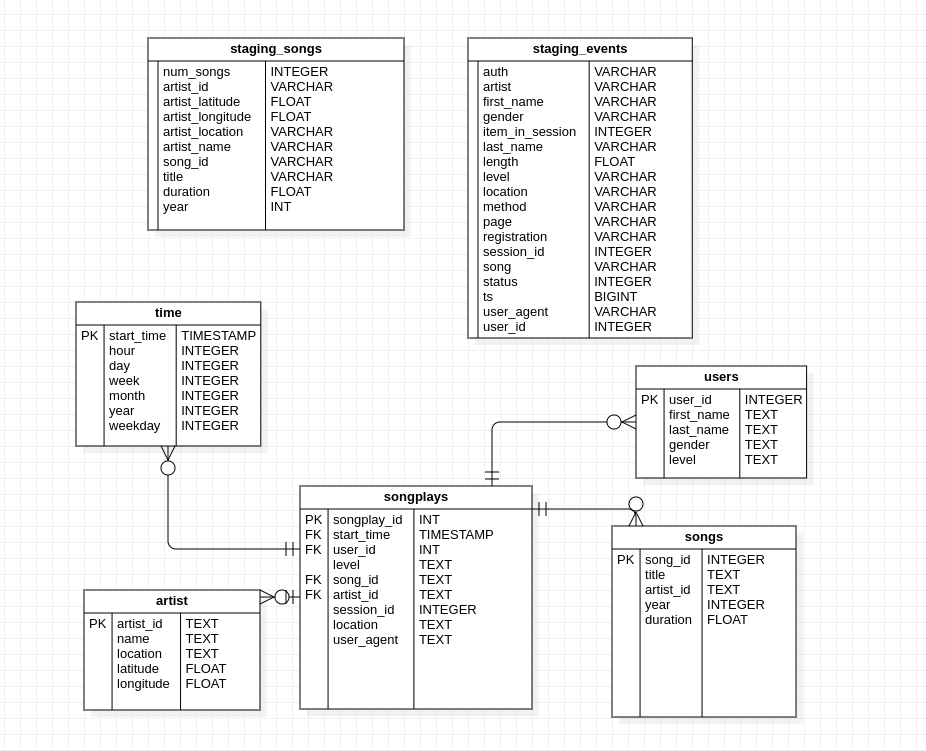

<h1> Project: Data Warehouse </h1>

A music streaming startup, Sparkify, has grown their user base and song database and want to move their processes and data onto the cloud. Their data resides in S3, in a directory of JSON logs on user activity on the app, as well as a directory with JSON metadata on the songs in their app.


In this context, an ETL pipeline was developed; the pipeline extracts their data from S3, stages them in Redshift, and transforms data into a set of dimensional tables for their analytics team to continue finding insights into what songs their users are listening to.

The collected data was processed and stored in the form of a star schema, allowing the business team to be able to analyze the songs heard by the customers using SQL queries.

<h1> Files description </h1>

The <code>images</code> folder is used for the purpose of storing the images used in this <code>README</code>. In short, it has the data model. 

The file <code>sql_queries.py</code> contains the sql queries that are executed during pipeline execution. In summary, there are DROP, CREATE, SELECT and INSERT statements.

<code>iac_create.py</code> create a IAM and a Redshift cluster.

The <code>create_tables.py</code> file contains functions that create and connect to the database and execute the DDLs statements.

The <code>etl.py</code> file contains functions that extract, transform and load the json files into the relational database.

The <code> iac_delete.py </code> delete the Redshift cluster.

<h1> Data description </h1>

Log_data brings information regarding the execution of songs by users in the application:

```javascript
{
    "artist":null,
    "auth":"Logged In",
    "firstName":"Celeste",
    "gender":"F",
    "itemInSession":1,
    "lastName":"Williams",
    "length":null,
    "level":"free",
    "location":"Klamath Falls, OR",
    "method":"GET",
    "page":"Home",
    "registration":1541077528796.0,
    "sessionId":52,
    "song":null,
    "status":200,
    "ts":1541207123796,
    "userAgent":"\"Mozilla\/5.0 (Windows NT 6.1; WOW64) AppleWebKit\/537.36 (KHTML, like Gecko) Chrome\/37.0.2062.103 Safari\/537.36\"",
    "userId":"53"
}
```
Song_data brings information regarding each music (song_id, title, duration, year) and its respective aritsts (artist_id, artist_longitude, artist_latitude, artist_location, artist_name)

```javascript
{
    "num_songs": 1,
    "artist_id": "ARMJAGH1187FB546F3",
    "artist_latitude": 35.14968,
    "artist_longitude": -90.04892,
    "artist_location": "Memphis, TN",
    "artist_name": "The Box Tops",
    "song_id": "SOCIWDW12A8C13D406",
    "title": "Soul Deep",
    "duration": 148.03546,
    "year": 1969
    }
```
The instances of these two objects were extract, transform and load into a Data Warehouse, using Redshift. The data is originally located on a Bucket S3.

<h1> Data Model </h1>

staging_songs - STG related to songs;

staging_events - STG related to events;

time - DIM related to time;

users - DIM related to app users;

artists - DIM related to the artists of the songs that played in the app;

songs - DIM related to the songs played in the app;

songplays - FATO related to the playing songs in the app;



<h1> Running the Pipeline </h1>

1 - Install dependencies and include KEY and SECRET of AWS in <code>dwh.cfg</code>;

2 - Run <code>iac_create.py</code> to create IAM, Redshift and the VPC port.

3 - Run <code>create_tables.py</code> to create the tables;

4 - Run <code>etl.py</code> to extract and transform the JSON files from Bucket S3 and upload this data into Data warehouse;

5 - Use <code>iac_delete.py</code> to delete Redshift cluster if necessary
